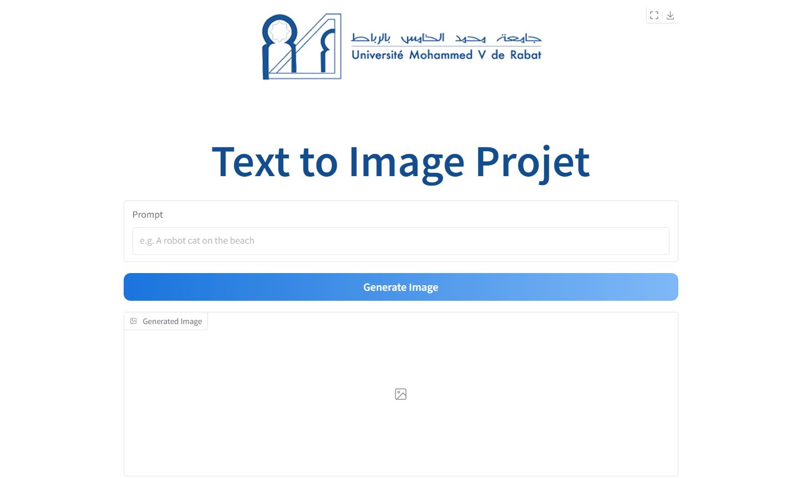
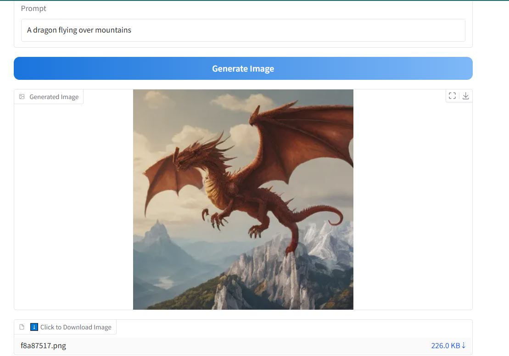

#  Text2Img Demo - Image Generation from Text Prompts

This project is a simple and fast **Text-to-Image generator** built using **Gradio** and **Stable Diffusion SDXL-Turbo** via Hugging Face Diffusers.  
It enables users to generate high-quality images based on natural language prompts instantly.

---

##  Description

This project demonstrates how to use `stabilityai/sdxl-turbo` to convert user prompts into realistic images using only 2 inference steps.  
It is deployed on [Hugging Face Spaces](https://huggingface.co/spaces/assiabelgueddar/text2img-demo) and uses a clean, interactive Gradio interface.

---

## Technologies Used

- [Gradio](https://gradio.app)
- [Hugging Face Diffusers](https://huggingface.co/docs/diffusers/index)
- [Torch](https://pytorch.org/)
- [SDXL-Turbo](https://huggingface.co/stabilityai/sdxl-turbo)

---

## Demo Screenshots

### Interface when opened


### Image successfully generated


---

## Clone this repository

```bash
git clone https://huggingface.co/spaces/assiabelgueddar/text2img-demo
cd text2img-demo
```

---

##  Run Locally

To run the app on your local machine (GPU recommended):

```bash
pip install -r requirements.txt
python app.py
```

---

##  Requirements

The following Python packages are needed:

```txt
gradio
torch
diffusers
transformers
accelerate
safetensors
```

---

##  License

- This project is licensed under the **MIT License**.
- The model `sdxl-turbo` is licensed under [CreativeML Open RAIL-M License](https://huggingface.co/stabilityai/sdxl-turbo/blob/main/LICENSE.md)

---

##  Author

Developed by [Assia Belgueddar- EL BACHIRI ABDESSAMED ](https://huggingface.co/assiabelgueddar)  
If you like this project, feel free to the Space and share it!
